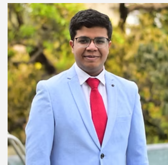

Hey! I'm Shreyas Agarwal - an Integrated Masters Student at IISER Kolkata navigating the blend of biology and data science. Currently exploring plant-insect interactions through network biology at ETH Zurich.

Fueled by a fascination for data's transformative power, I craft insights with a commitment to continuous learning and collaboration. My work embodies seamless data-driven revelations, highlighted in collaborative ventures such as my Master's Thesis with researchers from India and Switzerland.

Dive into my projects for a closer look. Looking ahead, my goal is to contribute to companies by decoding data, fostering growth, whether understanding customer behavior or unlocking the potential within sales data.